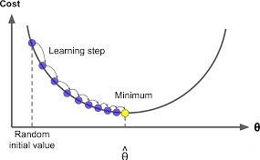

# Ⅰ. Logistic Regression

1. Unsere Aufgabe ist es, eine Gruppe von W, b zu finden, so dass unser Modell y' = σ(W^Tx+b) y bei gegebenem x korrekt vorhersagen kann. Hier können wir denken, dass, solange das berechnete y' größer als 0,5 ist, y' näher an 1 liegt, sodass es als "ist eine Katze" vorhergesagt werden kann, andernfalls ist es "keine Katze".
2. Wie zu suchen

    - Wir können eine Verlustfunktion definieren, um die Differenz zwischen y' und y zu messen:

        L(y',y) = -[y·log(y')+(1-y)·log(1-y')]
3. Abstrakt
    - alle Input können in einen Zeilenvektor geschrieben werden:

            X = (x(1)，x(2)，...，x(m))

        x(i) stellt manchmal ein Beispielbild dar

    - ähnlich für alle wahre Etikette: 
    
            Y = (y(1)，y(2)，...，y(m))

    - alle Prognosen: 
       
            Y' = (y'(1)，y'(2)，...，y'(m))

    - Cost function:

        stellt den durchschnittlichen Verlust über alle Trainingsgebiete dar

        J(W,b) = 1/m·Σmi=1L(y'(i),y(i))

    **Daher lässt sich unsere Lernaufgabe in einem Satz ausdrücken: Find W,b that minimize J(W,b)**

4. Gradient Decent

    
        
        w := w - α(dJ/dw)

    α ist learning rate

5. Forward und Backward Propagation

    

## abschließend:
- Logistisches Regressionsmodell: y' = σ(WTx+b), denken Sie daran, dass die verwendete Aktivierungsfunktion die Sigmoidfunktion ist.
- Verlustfunktion: L(y',y) = -[y·log(y')+(1-y)·log(1-y')], um die Differenz zwischen dem vorhergesagten Wert y' und dem wahren Wert y zu messen , je kleiner desto besser ist es gut.
- Kostenfunktion: Verlustmittelwert, J(W,b) = 1/m·Σmi=1L(y'(i),y(i)), ist eine Funktion von W und b, und der Lernprozess besteht darin, W und zu finden b, so dass J (W,b) Minimierungsprozess. Um den Mindestwert zu finden, verwenden Sie den Gradientenabstieg.

Schritte zum Trainieren des Modells:
- W und b initialisieren
- Geben Sie die Lernrate und die Anzahl der Iterationen an
- Bei jeder Iteration wird der entsprechende Gradient (die partielle Ableitung von J nach W, b) basierend auf dem aktuellen W und b berechnet, und dann werden W und b aktualisiert
- Bekommen Sie am Ende der Iteration W und b, bringen Sie es zur Vorhersage in das Modell und testen Sie die Genauigkeit auf dem Trainingssatz bzw. dem Testsatz, um das Modell zu bewerten

# Ⅱ. Shallow Neural Network und Deep Neural Network

Das neuronale Netzwerk ist es, eine oder mehrere versteckte Schichten auf der Grundlage der logistischen Regression zu hinzufügen. Das Folgende ist das einfachste neuronale Netzwerk mit nur zwei Schichten:

- Notation
    - z = wx+b
    - a = σ(z)
    - Die Indizes 1, 2, 3, 4 repräsentieren das i-te Neuron (Einheit) der Schicht 
    - Die hochgestellten Zeichen [1], [2] usw. repräsentieren den aktuellen Schicht
    - Die x1, x2, x3, x4 im obigen Bild repräsentieren nicht 4 Samples! Aber vier Merkmale (Werte in 4 Dimensionen) einer Probe! Wenn Sie m Proben haben, bedeutet dies, den obigen Vorgang m-mal zu wiederholen.
- Deep Neural Network

    - ist also Shallow Neural Network mit vielen Schichten
    - Beachten Sie, dass wir im tiefen neuronalen Netzwerk die Aktivierungsfunktion „ReLU“ in der mittleren Schicht anstelle der Sigmoid-Funktion verwenden und die Sigmoid-Funktion nur in der letzten Ausgabeschicht verwenden, da die ReLU-Funktion beim Auffinden von Gradienten schneller ist. Es kann auch das Phänomen des verschwindenden Gradienten bis zu einem gewissen Grad verhindern, weshalb es häufig in tiefen Netzwerken verwendet wird.
# Ⅲ. Convolutional Neural Network
### ähnlich wie Logistic Regression

1. input ---> X, shape = (8, 8, 3)
2. W1, shape = (3, 3, 3, 4), hier bedeutet 4 4 filter.
3. Z1, shape = (6, 6, 4), also no padding
4. activierende Funktion, z.B. ReLU, nach Aktivieren wird Z1 A1 sein, shape = (6, 6, 4)

### Begriff
1. convolution
2. pooling
3. padding
### Struktur von CNN
1. Convolutional layer - CONY
    = filters + activate function
    - hyper parameters: 
        - amount of filters
        - size of filters
        - stride
        - form of padding
            - valid
            - same
       - which activate function
2. Pooling layer - POOL
    - Maxpooling
    - Averagepooling
    - size of block ---> (2, 2)
    - stride ---> 2
3. Fully Connected layer - FC
    - ReLU
    - Softmax
4. Dropout
    dazu: https://blog.csdn.net/qq_52302919/article/details/122796577
    
    
    Die letzten beiden Spalten kleiner Kugeln stellen zwei vollständig verbundene Schichten dar. Nachdem die letzte Faltungsschicht abgeschlossen ist, wird das letzte Pooling durchgeführt, 20 12*12-Bilder werden ausgegeben, und dann wird eine vollständig verbundene Schicht zu einem 1*100-Vektor.

    Tatsächlich gibt es 20*100 12*12 Faltungskerne, die gefaltet werden. Für jedes Eingangsbild wird eine Kernfaltung derselben Größe wie das Bild verwendet,so dass das gesamte Bild zu einer Zahl wird.
### CNN vs. NN

Tatsächlich unterscheidet sich CNN nicht sehr von dem zuvor erlernten neuronalen Netzwerk. Das herkömmliche neuronale Netzwerk ist eigentlich ein Stapel aus mehreren FC-Schichten. CNN ist nichts anderes als die Änderung von FC in CONV und POOL, wodurch die traditionelle Schicht aus Neuronen in eine Schicht aus Filtern umgewandelt wird.

# Ⅳ Transfer Learning
- Verwenden werden die Modelle, die von anderen für das Verständnis von Bildinhalten trainiert wurden.
- Ersetzen wird die letzte Schicht
- Nur die letzte Schicht muss trainiert werden
- Kann aber auch alle Parameter trainiert werden - Pretraining

Durch die Verwendung von Gewichtungen, die von anderen vortrainiert wurden, ist es möglich, auch mit einem kleinen Datensatz eine gute Leistung zu erzielen.

https://nanonets.com/documentation/

