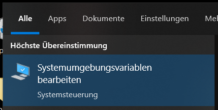

# Automatische Erkennung und Konvertierung von Tabellen in Bilddokumenten mit Hilfe von Machine Learning

## About this

Die ist ein Tool zur...

- Erkennung
- Extraktion
- Rekonstruktion

... von komplexen Tabellen aus Bilddokumenten.

Es basiert auf:

- Python
- Tesseract
- ... vervollständigen!!!

Es wurde für *Windows* entwickelt, lässt sich aber auch auf anderen Betriebssystemen zum Laufen bringen.
Das Tool besteht aus zwei wesentlichen Teilen:

1. Training von neuronalen Netzen mittels *Torch*. Dieses Training wird idealerweise auf einer rechenstarken Maschine ausgeführt (z.B. *Google Collab* mit GPUs).

2. Erkennung von Tabellen in Bild- oder PDF-Dokumenten auf Basis des zuvor trainierten neuronalen Netzes.

## Setup

Um beide Programmbausteine lauffähig zu machen, müssen folgende Schritte ausgreführt werden:

- Installation von *Python*
- Installation von *Python*-Paketen
- ...

### Installation von *Python* und Paketen

- Letzte Version von *Python* [hier](https://www.python.org/ftp/python/) herunterladen und installieren.

- Geforderte Pakete installieren: `pip install -r requirements.txt`

### Installation von *Elasticsearch*

- Elasticsearch kann nach folgender Anleitung installiert werden: [Installation Elasticsearch](https://youtu.be/Tn6zkPz-qHc?t=553)

1. *Elasticsearch* [hier](https://www.elastic.co/de/downloads/elasticsearch) herunterladen (getestet für *Version 7.17.1*).
2. Archiv entpacken (z.B. nach `D:\elasticsearch\`)
3. Navigation in den Ordner `elasticsearch\bin`
4. `elasticsearch.bat` ausführen, um die Installation zu starten.
5. `localhost:9200` im Browser eingeben, um erfolgreiche Installation zu testen. &rarr; Folgender Text sollte im Browser lesbar sein: "You know you search."

**Hinweis:** Die Version des pip-Packages für *Elasticsearch* muss zur installierten Version auf dem System passen!

### Installation von *Tesseract* (für Windows)

- Anleitung zur Installation: [*Installing and using Tesseract 4 on windows 10*](https://medium.com/quantrium-tech/installing-and-using-tesseract-4-on-windows-10-4f7930313f82)
- Installationsdateien [hier](https://github.com/UB-Mannheim/tesseract/wiki) runterladen (`tesseract-ocr-w64-setup-$VERSION$.exe`) und ausführen.
- "Additional script data (doiwnload)" und "Additional language data (download)" auswählen.

- Installationspfad wählen.
- Installationspfad zu Systemumgebungsvariable `PATH` hinzufügen.

- Neue Systemvariable erstellen:
  - Variablename: `TESSDATA_PREFIX`
  - Variablenwert ist Installationspfad, z.B. `C:\Program Files\Tesseract-OCR\tessdata`

- In der Datei *pytesseract.py* (Installationspfad, z.B. `C:\Program Files\Tesseract-OCR\tessdata`) ändern `tesseract_cmd = 'tesseract'`  in `tesseract_cmd =r'C:\Program Files\Tesseract-OCR\tesseract.exe"`

    oder: Bei Verwendung der Tesseract-OCR in python-code einfach `pytesseract.pytesseract.tesseract_cmd = 'C:\\Program Files\\Tesseract-OCR\\tesseract.exe'` nutzen
  - Install Tesseract package for Python: `pip install pytesseract`

- Install pytorch
  - bekommen Command for Installation hier [Pytorch](https://pytorch.org/get-started/locally/)

  <ddiv align="center">

  
  - kopieren und füren den Command in Terminal durch wie z.B. `pip3 install torch torchvision torchaudio --extra-index-url https://download.pytorch.org/whl/cu113`

## Programmablauf

Der Ablauf des Programmes kann anhand den Folgenden  nachvollzogen werden:

- Die Verarbeitung einzeles Bilds

  

- Stapelverarbeitung mehrer Bilder

  

## Ergebniss

- Die Verarbeitung einzeles Bilds
  - Vorbreitung und Normalizierung

   

  - Erkennung des Tablebreichs

   

  - Erkennung der Zelle

   

  - Rekonstruktion
    - Columen Detection mittels ML Modell, somit werden Labels von Columen erstellt.

      

      (Die rote Linie ist die Mittellinie der durch maschinelles Lernen erkannten Tabellenspalte, und die Zellen, die sich auf beiden Seiten der roten Linie innerhalb der grünen Linien befinden, werden in einer Spalte gruppiert.)

    - Zuweisung der Labels

      Labels von Rows werden durch Positon von jeder Zelle erstellt.

      

    - Rekonstruktion

      

    - Strukturnormalize
      - vertikales Schmelzen von zwei geschmelzbaren Zeilen
      - horizonales Schmelzen von der ersten und zweiten Spalte
      - Bestimmen der Zeilennummer von header
      - Bestimmen der Qualifikationen der Zellen in erster Zeile, dilatiert zu werden und ausgefüllt zu werden
      - Verarbeitung der erster Zeile
      - Schmelzen von header

      

- Stapelverarbeitung mehrer Bilder

  - Die Bilder im Verzeichnis werden zuerst formatiert,  alle PDFs werden Seite für Seite in das PNG-Dateiformat konvertiert.

   

  - Dann wird jedes Bild verarbeitet und in Elasticsearch geschrieben.

   

   

- Leistung bei komplexer Tabelle

  

  

  nach Strukturnormalize:

  

## Config

- python 3.10.0
- elasticsearch==7.17.1
- elasticsearch-dsl==7.4.0
- matplotlib==3.5.2
- numpy==1.22.4
- opencv-python==4.6.0.66
- opencv-contrib-python==4.6.0.66
- pandas==1.3.4
- torch==1.11.0+cu113
- torchvision==0.12.0+cu113
- albumentations==0.4.6
- Pillow==9.1.0
- pytesseract==0.3.9
- tesseract-ocr==v5.2.0.20220712
- fitz==0.0.1.dev2

