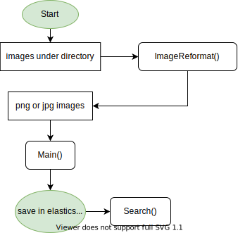
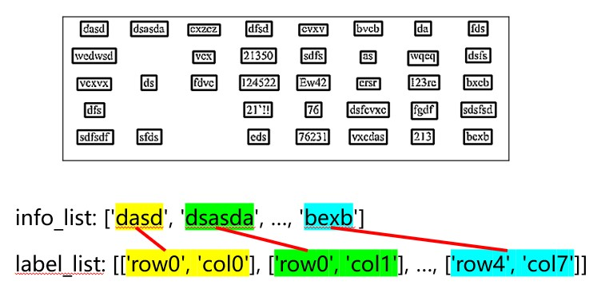
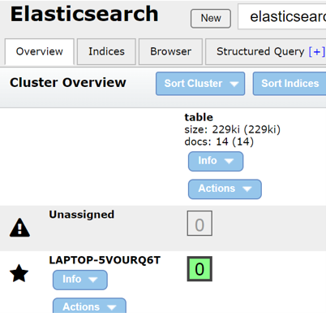

# 2022-projektarbeit-hui-chen

Hier ist der Arbeitsplatz für die Studienarbeit “Automatische Erkennung und Konvertierung von Tabellen in Bilddokumenten”.

**Ein Tool zur Erkennung, Extraktion und Rekonstruktion von Tabellen aus Bilddokumenten**

## Programmablauf
Der Ablauf des Programmes kann anhand den Folgenden  nachvollzogen werden:
- Die Verarbeitung einzeles Bilds

  

- Stapelverarbeitung mehrer Bilder

  

## Ergebniss
- Die Verarbeitung einzeles Bilds
   - Vorbreitung und Normalizierung
   
   - Erkennung des Tablebreichs
   
   - Erkennung der Zelle
   
   - Rekonstruktion
      - Zuweisung der Labels
      
      - Rekonstruktion
      
   - Einschreibung in Elasticsearch
   

- Stapelverarbeitung mehrer Bilder
   - Die Bilder im Verzeichnis werden zuerst formatiert,  alle PDFs werden Seite für Seite in das PNG-Dateiformat konvertiert.

   

   - Dann wird jedes Bild verarbeitet und in Elasticsearch geschrieben.

   
   

## Config
- python 3.10.0
- elasticsearch==7.16.0
- elasticsearch-dsl==7.4.0
- matplotlib==3.5.2
- numpy==1.22.4
- opencv-python==4.6.0.66
- pandas==1.3.4
- torch==1.11.0+cu113
- torchvision==0.12.0+cu113
- albumentations==0.4.6 
- Pillow==9.1.0

## Setup

- Install Python & pip
- Install *packagename* package for Python: `pip install *packagename*`
  packages: _Pillow_, _pandas_, _matplotlib_, _albumentations_, _numpy_
  
  Die entsprechende empfohlene Version finden Sie in **Config** 
  
  Achtung: Die Version von albumentations muss 0.4.6 sein, sowie opencv-python neuer als 4.5.x. 

- Installation von *Elasticsearch*

  Elasticsearch kann nach folgender Anleitung installiert werden: [Installation Elasticsearch](https://youtu.be/Tn6zkPz-qHc?t=553)

  1. Elasticsearch unter [elastic.co/start](https://www.elastic.co/de/start) herunterladen
  2. Datei Entpacken
  3. Navigation in den Ordner *bin*
  4. *elasticsearch.bat* ausführen, um die Installation zu starten
  5. `localhost:9200` im Browser eingeben, um erfolgreiche Installation zu testen

  Zum Ausführen in Python muss noch die Bibliothek installiert werden.
Dies kann im Terminal durch folgenden Befehl getan werden: `pip install elasticsearch`

- Installation von *Tesseract für Windows*:
  - Information für [Download](<https://medium.com/quantrium-tech/installing-and-using-tesseract-4-on-windows-10-4f7930313f82>)
  - auf [UB-Mannheim](https://github.com/UB-Mannheim/tesseract/wiki) klicken
  - die entsprechende Version herunterladen
  - Tesseract-OCR installieren

    
  - den Installationspfad wählen
    
    
  - zu den Systemvariablen (PATH) der Umgebungsvariablen hinzufügen

    
    
  - eine neue Systemvariable erstellen
    - Variablename: TESSDATA_PREFIX-Variablennamen 
    - Variablenwert ist Installationspfad, z.B. C:\Program Files\Tesseract-OCR\tessdata

    
  - in der Datei _pytesseract.py_ (unter dem Pfad, den Sie gerade installiert haben) ändern `tesseract_cmd = 'tesseract'`  in `tesseract_cmd =r'C:\Program Files\Tesseract-OCR\tesseract.exe"`
    
    oder: Bei Verwendung der Tesseract-OCR in python-code einfach `pytesseract.pytesseract.tesseract_cmd = 'C:\\Program Files\\Tesseract-OCR\\tesseract.exe'` nutzen
  - Install Tesseract package for Python: `pip install pytesseract`

- Install pytorch
  - bekommen Command for Installation hier [Pytorch](https://pytorch.org/get-started/locally/)
  
  - füren den Command in Terminal durch wie z.B. `pip3 install torch torchvision torchaudio --extra-index-url https://download.pytorch.org/whl/cu113`
